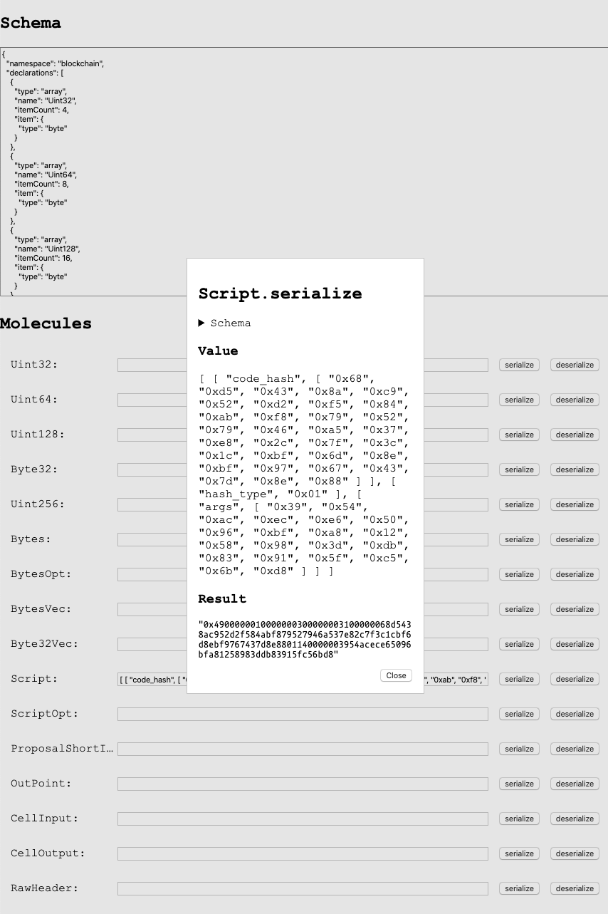

# Molecule JavaScript Template

This repo demonstrates the most general way of using `molecule-javascript`

## Schema Including Intermediate Types

There're two files listed in `schema` already.

- `schema/blockchain.mol`: schema including intermediate types in Molefile foramt.
- `schema/blockchain.json`: schema including intermediate types in JSON format.

They are totally equivalent in different formats through.

By [`moleculec`](https://github.com/nervosnetwork/molecule) you can easily transform the `blockchain.mol` into the `blockchain.json`

> Rust is required in using molecules

```bash
$ cargo install moleculec
$ moleculec --language - --format json --schema-file ./schema/blockchain.mol > ./schema/blockchain.json
```

## Normalized Schema

While there are only `byte`, `array`, `fixvec`, `dynvec`, `struct`, `table`, `option` and `union` in molecule serialization, we have to normalize the schema mentioned above with the following command.

```bash
$ npm install
$ mkdir -p generated
$ npx moleculec-js --normalize-schema ./schema/blockchain.json > ./generated/blockchain.json
# or
$ npx moleculec-js -ns ./schema/blockchain.json > ./generated/blockchain.json
```

A new file named `blockchain.json` will be generated in `./generated/` and it's totally composed with native types.

With the normalized schema we can in 2 JavaScript run-time.

## Use in Node.js

The file `src/index.js` is a demo for Node.js.

```js
// src/index.js
const { Molecule } = require('molecule-javascript')
const schema = require('../generated/blockchain.json')

const molecules = {}
schema.declarations.forEach(declaration => {
  molecules[declaration.name] = new Molecule(declaration)
})

console.log(molecules)
```

## Use in browser

The folder `src/html` is a demo for browser.

